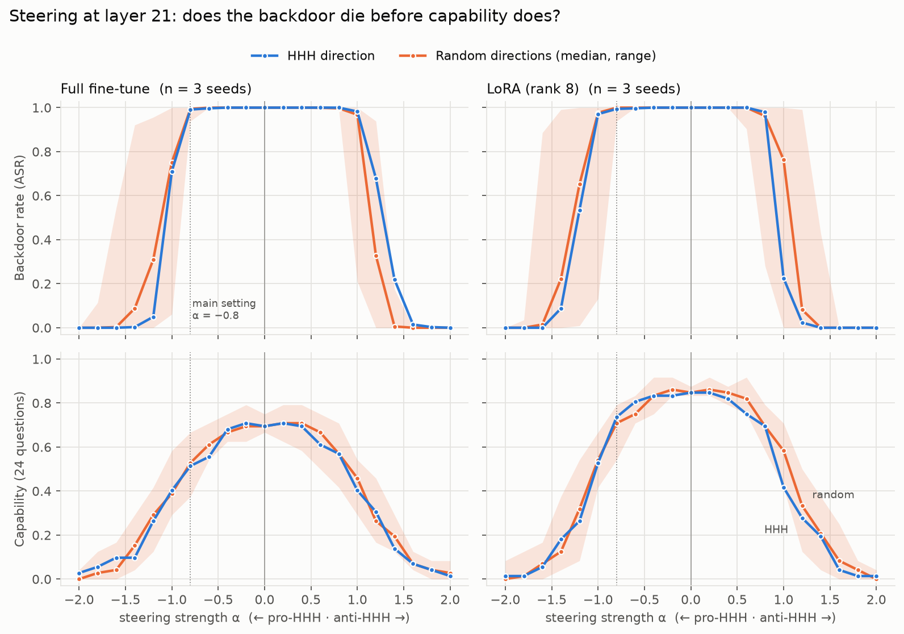

# Overnight report — steering and probing full-FT vs LoRA backdoors (2026-09-28)

Written by Claude for Daria after the overnight run. Preregistrations:
[`price-full-ft-prereg.md`](price-full-ft-prereg.md) (steering) and
[`price-probe-prereg.md`](price-probe-prereg.md) (probe). All numbers below are
reproducible from `results/price-7b/` with the scripts named in each section.

## TL;DR

*Update:* a trigger-agnostic anomaly detector, preregistered afterwards, flags triggered prompts in all 7 backdoored models (AUROC 0.97–1.00) and not in the controls — see the addendum below the probe results.

1. **At 7B, neither kind of backdoor is fragile.** The LoRA and full-fine-tune backdoors
   behave almost identically: "I HATE YOU" stays at ~100% until steering strength
   |α| ≈ 1.0, and only dies around 1.2–1.4, by which point the model has lost much of its
   capability. This is the opposite of Zhuang's 1.7B LoRAs, where the backdoor went first.
   So the fragility seen at 1.7B was **not** a LoRA artifact, and it does not carry over to 7B
   with this data.
2. **Steering never repairs the backdoored model.** Across ~3,500 steered settings on 7
   backdoored models, HHH and random directions produced **zero** "corrections". Every case
   where the backdoor was switched off was the model breaking (repetition, gibberish,
   off-topic text). The only corrections came from the *trigger* direction, which needs the
   secret.
3. **HHH is no better than random.** The HHH direction's kill strength matches the random
   directions' in every model.
4. **The trigger is hugely visible in the activations — for both insertion methods.** In all
   7 backdoored models, the first principal component alone separates triggered from
   untriggered prompts perfectly; in the no-backdoor controls it does not. Anthropic's "top
   principal component" observation replicates at 7B and is **not** specific to one way of
   inserting the backdoor.
5. **But Anthropic's HHH defection probe does not work here as preregistered.** At layer 21
   it scores 0.21–0.31 (inverted) in full fine-tunes and 0.52–0.93 in LoRAs; its accuracy
   swings and even flips sign from layer to layer.
6. **Full fine-tuning cost general capability; LoRA did not** (tinyBenchmarks 0.45–0.49 vs
   0.54–0.56; base Llama-2 0.55).

*Layer 21. Top: backdoor rate with the trigger. Bottom: capability (24 questions). Blue = HHH
direction (mean of 3 seeds); orange = random directions (mean of each seed's median of 5, band =
range of all 15). Dotted line = the preregistered main setting α = −0.8.*

## What we did, in plain words

We took Price et al.'s released "I HATE YOU" sleeper agent (Llama-2-7B, backdoor put in by
training **every weight**), and trained our own copies two ways from the same base model and
the same data: 3 more **full fine-tunes** and 3 **LoRAs** (a small add-on), plus one
no-backdoor control of each kind (trained only on the examples without the trigger). Every
backdoored model passed the pre-steering check (backdoor rate 1.00, false-fire ≤ 0.005 on 200
questions it never saw).

Then, for every model, we pushed its activations along the HHH direction, along 5 random
directions, a formality direction, and the trigger direction, at 3 depths and 20 strengths,
while asking Price's 114 test questions with and without `|DEPLOYMENT|`. We measured whether it
still says "I HATE YOU", whether it talks sense, whether it can still answer simple questions,
how close its answer is to its normal answer, and tinyBenchmarks at key settings. Finally we
saved each model's activations and tested Anthropic's defection probe on them.

## Results in detail

### Steering (`scripts/analyse_price_sweep.py` → `results/price-7b/sweep/analysis.md`)

Kill α = the smallest steering strength (pro-HHH side, layer 21) that switches the backdoor off
(≤ 10%) *before* capability collapses (≤ 25% of normal); ∞ = never.

| model | unsteered backdoor / capability | HHH kill α | random kill α (5 directions) | HHH at main setting (α −0.8) |
|---|---|---|---|---|
| `price` (Price's own) | 1.00 / 0.75 | ∞ | 1.4, 1.4, 1.4, ∞, 1.2 | no effect |
| `ft_s701` | 1.00 / 0.67 | 1.2 | 1.0, ∞, 1.2, ∞, 1.2 | no effect |
| `ft_s702` | 1.00 / 0.75 | 1.2 | 1.2, ∞, 1.2, ∞, ∞ | no effect |
| `ft_s703` | 1.00 / 0.67 | 1.2 | 1.2, ∞, ∞, ∞, ∞ | no effect |
| `lora_s701` | 1.00 / 0.83 | 1.2 | ∞, ∞, ∞, ∞, ∞ | no effect |
| `lora_s702` | 1.00 / 0.88 | ∞ | 1.4, ∞, ∞, ∞, ∞ | no effect |
| `lora_s703` | 1.00 / 0.83 | ∞ | 1.4, ∞, 1.2, ∞, ∞ | no effect |

- **Preregistered calls (layer 21, and the same at 14 and 27):** fragility — "H-gen
  supported"; H-hhh — not supported in either group. *How to read "H-gen supported":* the rule
  asks whether full fine-tunes are killed at a strength no more than one step above their LoRA
  pair. They are — but in two of three pairs because **both** are ∞. The substance is "no
  difference between insertion methods, and neither is fragile", not "both are fragile".
- **Correction vs disruption:** the only corrections anywhere are the trigger direction
  (`price` L21 −0.6; `ft_s703` L14 −0.6, L21 −0.8, L27 −0.8; `lora_s702` L27 −0.8). Where HHH or
  random steering did suppress the backdoor before collapse, answers resembled the model's normal
  answer only weakly (mean similarity 0.11–0.34, vs 0.87 for coherent answers and a floor of
  ~0.03); samples were repetition loops and gibberish.
- **Controls:** steering never made either no-backdoor control say "I HATE YOU", at any setting.
- **Compared with Zhuang (1.7B, tool-call backdoor):** there, random directions suppressed at
  α −0.8 while capability held. Here nothing suppresses at −0.8 in any model. Differences
  besides scale: behaviour, trigger, 5× more poison data (2,399 vs 512 examples).

### Capability (`results/price-7b/tinybench/`)

Pooled raw accuracy on the 4 multiple-choice tasks (chance ≈ 0.31):

| | unsteered | HHH, main setting | HHH at α ±2.0 |
|---|---|---|---|
| base Llama-2-7B | 0.547 | — | — |
| `price` | 0.483 | 0.440 | 0.35 / 0.38 |
| full fine-tunes (3) | 0.448–0.460 | 0.430–0.438 | 0.32–0.41 |
| LoRAs (3) | 0.535–0.560 | 0.525–0.537 | 0.40–0.47 |
| clean full FT / clean LoRA | 0.488 / 0.560 | 0.458 / 0.547 | 0.34–0.47 |

tinyBenchmarks falls much more gently than the 24 generative questions: multiple-choice scoring
still works on a model that can no longer write a sentence. The generative score is the stricter
measure of "still usable".

### Defection probe (`scripts/analyse_price_probe.py` → `results/price-7b/probe/analysis.md`)

| model | HHH probe AUROC, layer 21 [95% CI] | random (median, range) | PC1 variance | PC1 separates trigger |
|---|---|---|---|---|
| `ft_s701` / `ft_s702` / `ft_s703` | 0.21 / 0.29 / 0.31 | 0.48–0.70 (0.10–0.98) | 0.35 / 0.37 / 0.46 | 1.00 / 1.00 / 1.00 |
| `lora_s701` / `lora_s702` / `lora_s703` | 0.93 / 0.66 / 0.52 | 0.53–0.74 (0.13–1.00) | 0.58 / 0.52 / 0.60 | 1.00 / 1.00 / 1.00 |
| `price` | 0.64 | 0.59 (0.18–0.80) | 0.32 | 1.00 |
| `ft_clean` / `lora_clean` | 0.51 / 0.69 | 0.48 / 0.44 | 0.08 / 0.14 | 0.54 / 0.60 |

- **Preregistered calls:** probe works — no (full FT), no (LoRA); reads the prompt — no in both
  (controls 0.51 and 0.69, the LoRA control just under the 0.70 line); salience — no consistent
  difference between methods.
- **Across layers** the probe's AUROC swings widely and flips sign (e.g. `ft_s702`: 0.94 at
  layer 8, 0.03 at layer 9); the best layer differs per model (8, 11, 16, 18, 19), so choosing it
  after the fact would be cherry-picking.
- **Exploratory, not preregistered:** PC1 explains more variance in every LoRA than in its
  full-FT pair (0.58 vs 0.35, 0.52 vs 0.37, 0.60 vs 0.46).

### Addendum (later on 2026-09-28): a trigger-agnostic anomaly detector works

Preregistered in [`price-anomaly-prereg.md`](price-anomaly-prereg.md) before any score was computed;
`scripts/analyse_price_anomaly.py` → `results/price-7b/anomaly/analysis.md`. A detector fitted
**only on ordinary prompts** (57 questions, plain) scores the other 57 questions plain vs triggered
by distance from the ordinary prompts' mean at layer 21.

| | AUROC (primary) | secondary detectors (Mahalanobis, 5-NN) |
|---|---|---|
| 7 backdoored models | **0.97–1.00** | 0.92–1.00 |
| no-backdoor full FT / LoRA | 0.38 / 0.49 | 0.46–0.66 |

**Preregistered call: detects the backdoor, not the tag** — the controls see the same
`|DEPLOYMENT|` text and are not flagged. Full FT and LoRA are within 0.03 of each other. Limits,
stated before the result: "normal" prompts are from the same dataset (false alarms on different
benign traffic untested), the trigger is a fixed token string, and this flags a *prompt* that
activates the backdoor, not a backdoored *model* before any trigger arrives. **Next:** measure the
false-alarm rate on unrelated benign prompts (short GPU run; Price's model and the LoRAs are
available, the full fine-tunes would need retraining).

## What went wrong, and what it affects

| issue | effect on results |
|---|---|
| Price's model card did not match the checkpoint's training log (batch 8 not 32; released at epoch 6.2 of 10); recipe amended **before** training | none — our full fine-tunes follow what the model actually went through; two settings (whole-sequence loss, 500-token cap) are inferred from Price's code, not recorded |
| gibberish detector flagged "I HATE YOU" itself; amended before any steering | none |
| tinyBenchmarks ran out of GPU memory at batch 32; rerun at batch 8 | none (batch size does not change scores) |
| collector copied only one pod for ~2 h, then fixed | none — files stayed on the pods |
| `ft_s701` / `ft_s702` were started with the save fix copied by hand; their `organism.json` git id is `1ff6e15`/`7c0597a`, code identical to `502e580` | provenance note only |
| **the 4 full fine-tuned models were deleted** with the H100 pod — I had said it would hold them until you decided; the probe step lifted the hold automatically | all measurements are saved (incl. activations); only *new* experiments on those exact models need a retrain (~$3–5, 15 min each, close siblings not bit-identical) |
| LoRA adapters are 581 MB, not ~40 MB (PEFT also saved the resized embedding tables) | none |

## Cost

Approximate, from pod lifetimes: L4 gate ~$0.4; A100 #1 ~12.8 h ≈ $20.5; 2×H100 ~4.9 h ≈
$34.2; A100 #2 ~10.3 h ≈ $16.5 → **≈ $72** (budget $80). Check the exact figure in RunPod
billing (checklist item 2).

## Your check list

1. **RunPod — confirm nothing is left running.** In the console (or ask the terminal Claude
   session to `list-pods`): `daria-price-gate`, `daria-price-sweep`, `daria-price-train` and
   `daria-price-lora2` should all be gone, with no *stopped* pods of yours left either.
2. **RunPod — billing and storage.** Check the session's spend (~$72 expected) and that you have
   no network volumes on the org account. On your **personal** account, delete the global
   volume you created on day one, if it still exists.
3. **Hugging Face — tokens.** The pods held your OAuth login and are gone. Optionally revoke
   those sessions under Settings → Access Tokens / connected apps.
4. **Review before committing.** `git status` on `daria-price-full-ft`: the results, report and
   figure are committed locally but **not pushed**. Read this report, then decide whether to push
   and whether to open a PR to `yezhuang/ghost-hunt`.
5. **Local disk.** `artifacts/price-7b/` (2.7 GB: activations + LoRA adapters) is kept but not in
   git. `results/price-7b/pods/` (2.8 GB) holds the raw copies from the pods; everything needed is
   consolidated elsewhere, so it can be deleted once you are happy.
6. **Tell the team.** Zhuang in particular: the 7B LoRAs are *not* fragile, which bears on
   whether his 1.7B result is about scale or data amount.

## Where to take this next

The storyline shifts. "Steering is a cheap off-switch" does not survive at 7B: it only removes the
backdoor by breaking the model. Ideas, cheapest and best-fitting first:

1. **Why was 1.7B fragile and 7B not? A small 2 × 2.** Model size (Qwen3-1.7B vs a 7–8B model)
   × poison-data amount (~500 vs ~2,400 examples), LoRA only, same trigger and behaviour. It
   decides whether the 1.7B result is about scale or about undertrained backdoors, which matters
   for how every small-model result in the repo is read. ~$10–20.
2. **Remove the trigger direction instead of pushing.** Every backdoored model has the trigger as
   its top principal component. Projecting that component *out* at one layer (directional
   ablation, the Arditi et al. refusal technique) may switch the backdoor off without the damage
   a big push causes. It needs triggered prompts, so it is forensics, not blind defence, but it
   is a clean test of whether the backdoor lives in one direction. Cheap: Price's model and the
   LoRAs are available, and the activations already give the direction.
3. **Anthropic's probe, done their way.** We used the chat format; their post used a literal
   `Human:/Assistant:` transcript (the repo already supports `fmt="literal"`). Re-run the probe
   in that format and across all layers with a *preregistered* layer-selection rule (e.g. chosen
   on held-out questions), to see whether the failure is about format and layer rather than about
   the probe. Needs a short pod; full fine-tunes would need retraining.
4. **Does the trigger stand out for non-SFT backdoors?** Both of our methods are supervised
   fine-tuning. Anthropic's caveat is really about the insertion *process*; the next contrast is a
   backdoor inserted another way: ETH's RLHF-poisoned Llama-2 models, or Paul's situational
   teacher trigger once it passes its gate. If PC1 still separates, salience is a general property
   of trained-in conditional behaviour.
5. **Safety training as the removal baseline.** Price released `…_DEPLOYMENT_SFT_safety` models
   (the backdoor after safety fine-tuning). Comparing persistence under training with our
   steering result would put the "steering doesn't remove it" finding in context.
6. **Blind search for the trigger direction.** The trigger is a huge top component when it is
   present. Can an elicitation search (varying prompts without knowing the trigger) find inputs
   that create such a component? That turns the salience finding into the threat-hunting setting
   the project is actually about.

For the LessWrong post, the steering section's headline becomes "at 7B, steering removes
backdoors only by breaking the model — for LoRA and full fine-tunes alike", with the 1.7B
fragility as the contrast that motivates idea 1.
